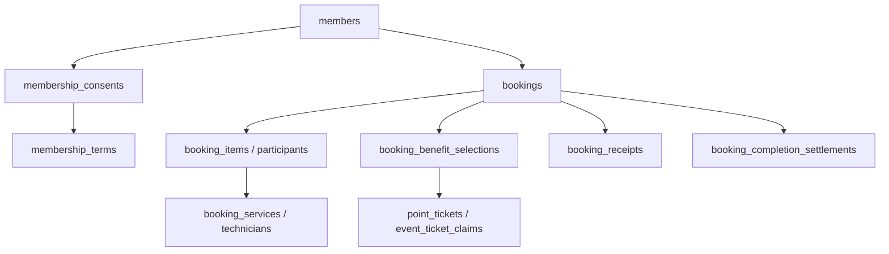

# MemberWebsocket-dev 資料庫架構與舊功能清理

本次以 main 的現行程式、線上 PostgreSQL catalog、已部署 Edge Functions 和實際資料前置檢查為依據。清理目標是移除已被新版流程取代的儲存結構與介面，並保留資料完整性、API 認證與現行業務流程。

## 已確認事實與結果

- 線上業務 schema 清理前有 54 張 public 資料表、194 個非 extension 函式。
- 舊壽星 API 已停用；舊發放紀錄為 0、舊設定停用。
- 票券具體項目 ID、地點陣列與每日上限無待轉換資料或衝突。
- 兩階段變更移除 2 張資料表、13 個過渡欄位、18 個舊 RPC；線上清理後實際為 52 張 public 表、176 個非 extension 函式。
- 3 個舊轉換 trigger 被移除，避免新增票券時覆寫新版 required_service_ids。
- 不刪除會員、預約、點數、票券、稽核、收據或 E2E 業務紀錄。

## 線上部署與驗證紀錄

2026-10-05 UTC 已完成 main 部署與 Supabase 清理。GitHub 實作 commit 為 `0a1a6188d8a6daf2bcc9bcd3663e08eb8e3bb4b4`，驗證 SQL 修正 commit 為 `6fd69f808afcc8dddf3bbd78949ea3393fe4bc13`。

| 項目 | 結果 |
|---|---|
| Supabase migration `prepare_current_schema_contract` | 已套用；線上 version `20261005105018` |
| Supabase migration `retire_unused_legacy_schema` | 已套用；線上 version `20261005105101` |
| Edge Functions | api v60、booking-api v40、booking-group-api v28、event-ticket-extension-api v9、booking-receipt-api v13、booking-admin-operations v15；皆 ACTIVE，所有部署檔案與 main 程式一致 |
| 線上 contract | 52 張 public 表、176 個非 extension 函式、6 個 active cron；舊表、舊欄位、舊 RPC、失效定義引用、未啟用 RLS 的 public 表、新公開 RPC 權限皆為 0 |
| 資料保留 | 會員、管理員、預約、點數異動、活動票券、發放紀錄、測試執行、稽核與收據的筆數與清理前一致 |
| Schema 文件 | `schema-current.json` 的全部 56 張 public/私有支援表與線上欄位、PK、FK、RLS metadata 完全一致 |
| CI | [run 37298250673](https://github.com/yongshengchen0615/yongshengchen0615.github.io/actions/runs/37298250673) 全部通過：回歸、PostgreSQL 清理回歸、DOM、Edge 型別、架構與 Chromium 管理/會員/收據/GPS 測試 |
| 前端 | GitHub Pages build/deploy 成功 |

migration 檔名由 Supabase CLI 產生；Management API 套用時記錄實際套用時間，因此上表明確對應線上 version。線上未操作真實會員或 LINE 訊息；瀏覽器與資料變更測試使用隔離 fixture。直接 HTTP 探測受此執行環境的網路限制而未完成，已透過 Supabase 讀回完整部署程式、ACTIVE 狀態與 catalog 驗證部署結果。

Security advisor 沒有新增警示；保留既有 `pg_net` 位於 public 的 [extension placement 警示](https://supabase.com/docs/guides/database/database-linter?lint=0014_extension_in_public)。它是目前通知排程使用的系統 extension，不是舊業務功能。

## 現行 Domain 與資料表

| Domain | 現行資料表 | 責任與邊界 |
|---|---|---|
| 身分、會員與條款 | `members`, `admins`, `membership_tier_settings`, `membership_terms`, `membership_consents`, `member_presence_sessions` | 會員狀態、資格、LINE 身分、管理員角色及條款同意分開管理。會員等級不授予管理權限。 |
| 集點卡、點數與服務時間 | `point_cards`, `ticket_templates`, `point_card_rewards`, `point_balances`, `point_entries`, `point_tickets`, `point_card_settings`, `point_transfers`, `service_time_entries` | 點數餘額、異動帳、票券資格與服務時間各自保存；票券項目限制放在 reward node。 |
| 活動與固定票券 | `event_tickets`, `event_ticket_claims`, `event_ticket_settings`, `fixed_ticket_templates`, `fixed_ticket_grants` | 生日、週期自動票券統一使用 fixed_ticket_templates；每日票券上限只由 max_tickets_per_day 決定，0 為不限。 |
| 預約與結算 | `booking_settings`, `booking_service_types`, `booking_services`, `booking_service_type_rewards`, `booking_technicians`, `bookings`, `booking_items`, `booking_participants`, `booking_participant_items`, `booking_participant_reservations`, `booking_benefit_selections`, `booking_completion_settlements`, `booking_audit_events`, `admin_booking_notifications`, `admin_booking_notification_reads` | 營業時間、提前天數、切分間隔由 booking_settings 統一管理；保留多人預約、技師排程、使用票券與完成結算。 |
| 收據與無障礙預約 | `booking_receipts`, `booking_receipt_cleanup_queue` | 收據驗證、檔案替換與無障礙登記共用目前 API；private Storage bucket 的物件清理由 queue 追蹤。 |
| 日曆、推薦與通知 | `calendar_items`, `member_referrals`, `grant_message_presets`, `scheduled_grant_messages` | 活動加點、好友邀請與排程通知保留現行規則；推薦優惠繼承具體項目 ID 與 any/all 限制。 |
| 稽核、重試與即時同步 | `audit_logs`, `idempotency_results`, `api_rate_limits`, `realtime_events` | 稽核、冪等結果、限流與即時失效事件均為運作中基礎設施。 |
| 維護模式與 E2E | `test_mode_settings`, `test_login_sessions`, `automation_test_runs`, `automation_test_cases`, `automation_test_steps`, `e2e_evolution_state`, `test_execution_leases` | 維護狀態、PC/手機測試登入、session revocation、測試證據與執行租約保留。 |

私有支援結構：`booking_notifications.config/outbox` 管理通知佇列；`line_config.settings/audit_log` 保存 LINE 設定路由與設定稽核；真正 secret 保存在 Supabase Vault。`maintenance` 保存清除與 baseline 還原函式，`private` 保留管理操作包裝。Supabase 管理的 `auth/storage/realtime/vault/cron/net/extensions` 不視為舊業務 schema。

`members.status` 是帳號可用狀態、`membership_status` 是會員申請狀態、會員等級由服務時間與 tier 設定計算；`admins.role/status` 控制管理權限。現行系統使用 LINE ID token 與受限的測試登入 session，並未建立獨立的密碼、方案或訂閱資料表，因此本次不新增空的 Credential/Plan/Subscription 模型。

## 相依關係

箭頭表示業務資料連結；完整欄位、PK 與 FK 以 `supabase/schema-current.json` 為準。`bookings.service_id`、`booking_items` 與多人明細仍被現行結算和通知流程使用，不能因為看似重複就刪除。新版 `_v2/_v3` 名稱也不等於過期；例如 settings v4 仍呼叫 v3 核心，group v2 仍呼叫原子核心 RPC。

## 移除物件與取代方式

| 舊結構 | 現行唯一來源 |
|---|---|
| `birthday_benefit_settings/grants`、`issue_birthday_benefits`、未載入的舊生日 UI 資產 | `fixed_ticket_templates/grants` 的 `birthday_month` 規則 |
| `event_tickets/point_card_rewards.required_service_types` 與同步 trigger | `required_service_ids` + `required_service_match_mode` |
| 單一 GPS 的 3 個舊欄位、單站 constraint 與同步 trigger | `redemption_locations` 與陣列完整性 constraint |
| 活動票券 `max_tickets_per_redemption` | `event_ticket_settings.max_tickets_per_day`（集點卡的單次上限仍獨立保留） |
| `test_mode_settings.enabled/allow_admin_user_login`、mode v1–v3 RPC | `maintenance_enabled`、PC/手機權限與 `admin_save_maintenance_test_access` |
| `booking_services` 的個別營業時間、slot、提前天數與可用星期 | `booking_settings` 共用營業與提前限制，搭配營運日曆 |
| 舊 receipt「完成預約」、無優惠無障礙登記、單項預約 RPC、未引用的服務類型 rename、舊 settings overload | 現行 receipt finalize、with-benefits 登記、bundle/group 與 settings v4 流程 |

完整精確 signature 列於 `supabase/schema-contract.json`。歷史 migration 保留不修改；rollback 和測試 fixture 保存舊定義作為回復與回歸證據，不會重新部署舊功能。

舊 JSON 欄位在 Edge 邊界仍可轉譯為目前模型，回應中的舊 GPS 欄位從地點陣列計算，活動票券舊上限回應從每日上限計算。這些相容欄位沒有獨立儲存或業務規則。已停用 Edge endpoints 僅保留無權限的 HTTP 410 回應，沒有資料庫存取能力。

## 部署與回復

1. 套用 `20261005101816_prepare_current_schema_contract.sql`，更新 12 個相依函式、移除 3 個過渡 trigger 與舊 GPS constraint。
2. 部署 `api`、`booking-api`、`booking-group-api`、`event-ticket-extension-api`、`booking-receipt-api`、`booking-admin-operations`，包含它們引用的共享模組。
3. 套用 `20261005101853_retire_unused_legacy_schema.sql`。所有 DROP 使用 RESTRICT；active E2E lease、待轉換資料、啟用生日舊規則或上限衝突會讓 transaction 中止。設定 lock timeout 5 秒、statement timeout 45 秒。
4. 執行 `supabase/verify_schema_contract.sql`；所有 retired/obsolete/RLS/RPC 公開權限陣列須為空。

若部署後需緊急回復，先執行 `supabase/rollback/restore_legacy_schema_contract.sql` 還原資料庫相容性，再回復 Edge 與前端 commit。舊生日設定會以停用狀態重建；廢棄的服務欄位依預設值重建，而非回復已不被使用的歷史個別設定。此 rollback 需管理員執行，不是下一個自動 forward migration。

## Security 與驗證範圍

- public 業務表仍保留 RLS；後端專用表不為了消除 advisor 的「RLS enabled no policy」INFO 而增加公開存取。
- CREATE OR REPLACE 保留既有函式 ACL；舊 RPC 的 PUBLIC/anon/authenticated 執行權限不重新授予。
- 六支 Edge 沿用現行 LINE／測試 session 認證、active admin 與 resource ownership 檢查；沒有新增 secret 或公開資料權限。
- `line_config` 是非 exposed schema，仍由其設定函式與角色 grants 控制；不將私有設定或稽核搬到 public。
- PostgreSQL 回歸從線上 DDL 的空白 fixture 重建，驗證阻擋條件、完整性、測試帳號、QA purge 與 full reset。fixture 不包含會員資料、secret 或設定值；pgcrypto SHA-256 與 cron/Vault 環境僅提供必要平台結構。
- 既有 Node 回歸、相關 DOM/SQL integration、受影響 Edge 型別檢查與整合中心的 Chromium journey 都納入驗證。瀏覽器 fixture 是隔離 transport，不宣稱為真實 LINE 訊息傳送。

新增功能時同步更新 schema 文件、contract 和驗證；不能只根據空表、函式名稱或索引使用次數判定可刪除。
