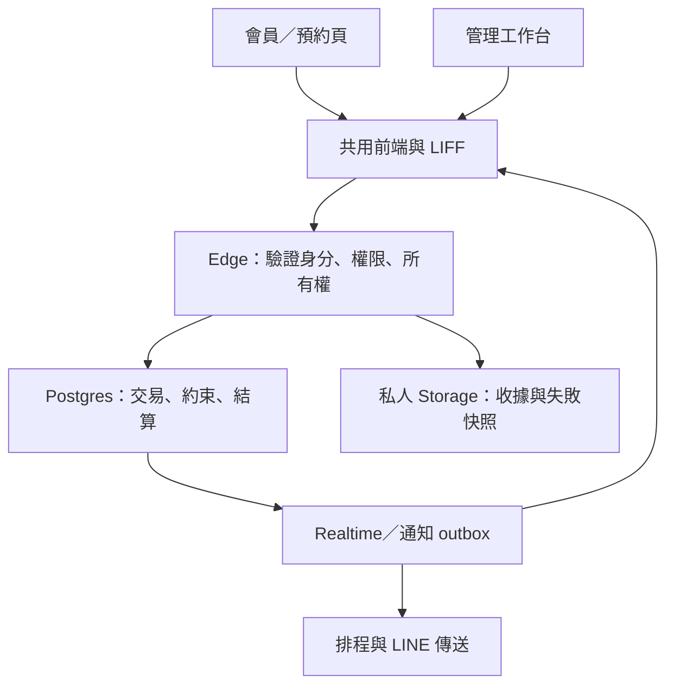

# 系統分析、條件式破壞風險與 E2E 優化

日期：2026-10-03（Asia/Taipei）。分析基準：`b056efd7554bb6fb072c7d2e6f532c3db5481c2c`。
範圍：MemberWebsocket-dev、相關 GitHub Actions、Supabase 專案 `dbuquirnaskrwcamdxki`。

## 結論與可信度

**FACT：未找到足以判定「有人刻意植入惡意邏輯炸彈」的證據；找到並重現了會在特定條件下誤刪資源、重設正式設定及干擾測試的程式缺陷。** 已修正清理來源判斷、主要技師保護、E2E 啟動競態、併發工作收尾、逾時後重新啟動隔離，以及診斷分類與搜尋效能。

「沒有發現」不是不存在的保證。本次盤點程式、遷移、排程、授權及部署版本，並深入檢查相關執行路徑；未完成全部歷史 commit 的來源鑑識、第三方依賴完整供應鏈稽核、滲透測試或正式會員全流程驗收。

**ASSUMPTION：** 本次「系統」沿用既有專案脈絡，指 MemberWebsocket-dev，而非 repository 裡所有其他品牌／寺廟／工具專案。

## 1. 架構與責任邊界

| 層次 | 主要責任 | 分析結果 |
| --- | --- | --- |
| GitHub Pages | 會員、點數、活動、日曆、預約及管理 UI | 靜態前端；隱藏按鈕不是權限邊界 |
| 共用前端 | 登入、設定、即時失效事件、測試 Session | 正式 LINE 身分與測試 Session 分開；會員等級沒有取代管理權限 |
| Edge Functions | LINE token 驗證、有效管理員、會員所有權、輸入及限流 | 使用自訂身分驗證；`verify_jwt=false` 不能單獨推論為匿名可用 |
| PostgreSQL | 鎖定、版本衝突、預約／點數／票券結算、去重 | 關鍵交易集中於 RPC；本輪未改動會員結算規則 |
| Storage | 收據及失敗圖片 | 兩個 bucket 都是私人；不是公開照片 URL |
| E2E | 共用後端 QA、管理 UI、獨立測試會員與跨端接手 | 與一般頁面的登入、資料及 UI 有相依，需要限制工作並行及生命週期 |

盤點包含 318 個正式相關原始檔／遷移／入口設定，其中 JavaScript 66、TypeScript 49、SQL 194、HTML 8、JSON 1；這是檔案盤點數，不表示每個檔案均完成逐行形式驗證。65 個瀏覽器 JavaScript 已做語法檢查。線上有 31 個 Edge Functions，包含明確回傳 410 的舊相容端點。

## 2. 線上資料與權限證據

- FACT：公開資料表均啟用 RLS。查到的 public `SECURITY DEFINER` 函式中，允許 anon／authenticated 執行的數量為 0。
- FACT：主要操作採 Edge 高權限 client，直接用戶資料存取保持封鎖。52 個「RLS enabled no policy」是資訊提示；不能為消除提示開放所有會員資料。
- FACT：`e2e-failure-artifacts` 為私人 WebP bucket，上限 2 MB；`booking-receipts` 為私人照片 bucket，上限 5 MB。
- FACT：檢查時 `automation_test_runs` 有 0 筆。因此沒有可用的完整實跑歷史來計算整輪 E2E 的加速幅度或失敗率趨勢。
- FACT：檢查時負點數餘額為 0；完成／取消／拒絕預約仍留 pending 票券選擇的數量為 0。資料量小，不能以此證明所有高併發場景安全。
- FACT：security advisors 仍有 `pg_net` 位於 public 的警告；performance advisors 有 4 個未使用索引提示。本輪沒有直接搬移 extension 或刪除索引。
- FACT：PostgreSQL 為 17.6。版本升級與 extension 相容性應另安排；本輪未做可能中斷服務的資料庫升級。
- FACT：maintenance schema 的清除函式沒有 anon／authenticated execute；`ensure_referral_reward_baseline` 雖沿用預設 execute，但為 invoker，這兩個角色也沒有 maintenance schema usage。未將它誤報成可直接呼叫的高權限後門。

參考：[RLS 提示](https://supabase.com/docs/guides/database/database-linter?lint=0008_rls_enabled_no_policy)、[pg_net 提示](https://supabase.com/docs/guides/database/database-linter?lint=0014_extension_in_public)、[未使用索引](https://supabase.com/docs/guides/database/database-linter?lint=0005_unused_index)。

## 3. 邏輯炸彈檢查與已確認缺陷

檢查將「惡意意圖」與「條件式破壞效果」分開。時間、帳號、資料量或名稱觸發本身不是惡意證據；需要看觸發後的操作、授權、資料來源及是否符合業務用途。

| 類型 | 觸發條件與路徑 | 結論 |
| --- | --- | --- |
| 名稱觸發誤刪 | 管理員清除測試資料；正式資源的名稱／編號以 QA 開頭 | 已重現的資料安全缺陷，已修正 |
| 正式設定重設 | 執行延伸 QA 清理，即使現有主要技師有效 | 已重現的設定副作用，已修正 |
| 延遲任務干擾 | 節點逾時後，原 Promise 繼續執行，新一輪重用同一 Runner | 已確認的生命週期缺口，已增加隔離與等待中止 |
| 登入前重入 | 兩次啟動在 Session 檢查完成前到達 | 已重現的競態，已修正 |
| 並行提前收尾 | 一個 worker 拒絕，其他 worker 尚未完成 | 已重現的編排缺陷，已修正 |
| 排程清理 | 30 天失敗圖片保留、待上傳收據到期等 | 與明確保留政策相符，未見無條件清除正式會員的排程證據 |
| 管理端全資料清除 | 明確管理流程／維護函式且需 confirmation 參數 | 屬既有破壞性管理能力，與一般 E2E 清理分開；本輪未執行 |
| 動態執行／陌生目的地 | 正式程式的 eval／new Function、遠端目的地與退休端點 | 未見正式程式使用 eval／new Function 執行藏碼；另一 Supabase 位址位於退休端點的回應說明，沒有將會員請求轉送過去 |

### 3.1 清理依據使用可編輯標題與編號

原 `admin_purge_test_data()` 以 `created_by like 'qa:%'` **或** `QA-` 編號、`E2E QA `／`QA ` 標題判斷 calendar、event、point card、ticket template。沒有正式會員引用的正式設定仍可能被刪除，尤其是尚未使用的新設定。

修正：批次清理只依伺服器寫入的 QA 建立來源；移除名稱與 public identifier 的替代判斷。保留原本引用檢查、正式與測試會員跨界交易拒絕、advisory locks 及回應契約。

延伸清理也不再因固定票券標題或 reward 的 `updated_by` 被 QA 修改就判定它是 QA 所有。服務類型沒有可靠的建立來源欄位，因此不再僅依名稱自動刪除；`deletedBookingServiceTypes` 可以為 0，未標記資料保留供明確檢查。

**INFERENCE：** 未標記的 UI 測試殘留可能增加。這是保護正式資源所接受的保守取捨；下一步應增加不可由顯示名稱替代的 run-resource 登記，而非重新開放標題判斷。

### 3.2 清理總是覆蓋主要技師

原 `admin_purge_extended_qa_artifacts()` 最後對 booking_settings 做 unconditional upsert，把 `primary_technician_id` 改成「系統主要技師」，同時改動版本資訊。這可能改變之後服務結算使用的主要技師規則。

修正：僅在原 QA 技師被移除，或完全缺少主要設定時建立 fallback。有效非空設定、原 updated_by／updated_at 及技師排序／啟用設定均保留。服務類型沒有可靠 provenance 時保留。原 RPC 參數及回應欄位不變。

### 3.3 逾時不會取消原 Promise

`Promise.race` 只能讓等待者取得逾時結果，不能撤銷底層 DOM 操作、已送出的 API 或資料庫交易。舊程式停止下一個節點，但結束狀態後可再啟動，舊動作可能晚到。

修正：deadline callback 取得原 action Promise；兩個 Runner 都保留尚未結束的逾時節點，未結束前拒絕新一輪。主要 UI 等待偵測此狀態後結束，不繼續消耗完整輪詢期限；管理端共用等待改用 `performance.now()`，避免系統時鐘調整干擾該等待。

**限制：** 這是同一 Runner 的隔離，不代表伺服器取消或交易回滾；尚未被改造的內層等待／外部 API 可能繼續完成。若底層永不結束，該 Runner 不會自動重新開放，以免舊／新任務交錯。

### 3.4 同時啟動與併發提前收尾

用戶端原本在第一個 async Session 檢查之後才設 running。現在開始前先取得執行旗標；驗證失敗釋放旗標。

併發執行原本以 `Promise.all(workers)` 等待，一個 worker 拒絕就立即離開外層，其他 worker 仍可能操作測試視窗或資源。現在保留第一個錯誤、停止派送新參與者，等待已開始的 worker settled，再向外回報原始錯誤。保留既有工作站資源上限，沒有提高並行數來換表面速度。

## 4. E2E 診斷與執行效能

### 分類準確性

原分類先比對「Realtime／timeout」文字，再檢查 401／403／5xx；案例名稱含同步或逾時時，根因可能被錯誤歸類。現在明確 HTTP 狀態優先於案例標題／描述，保留 popup／Runner 專用生命週期分類。

401 → authentication；403 → authorization；429 → rate limit；5xx → backend。Function path 的 404 且有 gateway `NOT_FOUND`／`FUNCTION_NOT_FOUND` 證據 → deployment route。業務 `RECEIPT_NOT_FOUND` 不推論成缺少部署；預期的負面測試 4xx 也沿用既有排除邏輯。

診斷 path 移除 query／fragment，避免把查詢參數帶進 fingerprint。指紋不使用原始錯誤文字；原始 trace 仍留供檢查。

### 有界搜尋與量測

原 `findField` 的深度／分支限制仍可讓寬樹重複搜尋大量節點。新版本每次搜尋共用 256 物件訪問上限，以 WeakSet 排除循環，沿用欄位／陣列及深度上限；明確 trace.error 另外搜尋，避免被大型 actual 把搜尋額度耗盡。

| 固定微基準 | 修正前單次中位 | 修正後單次中位 | 比率 |
| --- | ---: | ---: | ---: |
| 缺失欄位搜尋 | 2.917 ms | 0.105 ms | 約 27.9 倍 |
| 完整診斷分類 | 12.834 ms | 1.396 ms | 約 9.2 倍 |

輸入 166,711 bytes，80×80 寬樹；預熱 20 次，5 組，搜尋每組 200 次、完整分類每組 100 次，以組別中位數報告。這是固定 Node 工作負載；一般小快照、Edge 執行與整輪瀏覽器 E2E 不能直接套用此倍率。搜尋上限可能忽略極深或極寬的非標準欄位；完整證據仍可人工檢查。

重現：`node MemberWebsocket-dev/tests/benchmark_e2e_diagnostics.cjs b056efd7554bb6fb072c7d2e6f532c3db5481c2c`。

### 線上效能與瓶頸

統計工具的預設近 24 小時 Function POST log，200 回應：主要 api 平均約 991 ms、P95 約 1,987 ms；booking-api 平均約 1,157 ms、P95 約 2,189 ms；booking-receipt-api 平均約 1,132 ms、P95 約 2,151 ms。這是混合使用流量，未依每個 action 或 E2E run 區分，亦不是改動前後比較。

**INFERENCE：** 整輪 E2E 的主要耗時仍可能來自外部驗證、網路、背景視窗計時、UI／跨端同步及預約交接，而非單一診斷函式。應先取得逐節點／逐請求紀錄，再決定增加併發或減少等待。

CI 本輪加入 JUnit regression artifact（7 天保留），使每個案例的結果與耗時可下載；補進新的 SQL 邊界整合測試及原先漏列的 event-ticket-extension-api 型別檢查。E2E script、scenario graph 及 loader 的快取版本同步，新增宣告版本與實際請求版本一致檢查。

## 5. 驗證、部署與安全審查

| 驗證 | 結果與限制 |
| --- | --- |
| Node 回歸 | 608 項通過；新增 7 個行為案例 |
| DOM／SQL 整合 | 71 項通過；新增 3 個清理邊界案例 |
| 背景啟動＋清理重跑 | 13 項通過 |
| SQL 修正前重現 | 實際舊 migration 函式會刪除同名正式 template、改掉正式主要技師 |
| SQL 修正後 | 同名正式資源、原設定、無來源標記類型保留；QA 技師刪除後才補回 fallback；重複清理安全 |
| 權限 | PGlite 中 anon／authenticated 不能呼叫清理 RPC；線上 execute 均 false，service_role true |
| JavaScript／Deno | 65 個瀏覽器腳本語法通過；test-control-api、user-test-api、event-ticket-extension-api 型別通過 |
| 線上 migration | 已套用 harden_qa_cleanup_boundaries；只更新函式定義與 ACL，沒有呼叫清理 |
| 線上 Edge | test-control-api v31、user-test-api v23 ACTIVE；重新讀取部署 bundle，診斷來源與已測版本相符 |
| 無身分 HTTP | 管理 API 回 401 AUTH_REQUIRED；會員 QA API 回 401 TEST_SESSION_INVALID |
| 設定保護 | 部署前後 booking_settings row fingerprint 相同 |

PGlite 使用涵蓋相關 SQL 欄位的精簡 schema，digest 為測試替身；測的是正式 SQL 清理路徑、資料保留與 execute 邊界，不代表正式多連線鎖壓測。VM／DOM 驗證也不能代替真人 LINE WebView、相機、Storage 像素截圖或實際 LINE 收件。線上沒有執行清除資料、會員扣點、完成正式預約或發送訊息。

部署保留兩個 Edge Functions 原本的自訂 LINE／測試 Session 驗證方式，沒有增加公開資料讀取政策，沒有把高權限 API key 放入前端，也沒有改變業務 RPC 參數或現有資料表結構。

## 6. 剩餘風險及建議順序

| 優先級 | 已知事實／推論 | 建議與驗收 |
| --- | --- | --- |
| P1 | QA fixture 與正式資料共用專案、部分管理案例會改共用設定 | 為每輪建立明確資源登記及 server lease；必要時隔離 QA 資料庫。驗證兩個管理員同時執行、清理中啟動及 Runner 中斷 |
| P1 | 單筆 cleanup-ticket-template API 仍有標題式判斷，只有已驗證管理員能呼叫 | 改為 run-resource 所有權與建立版本；本輪已封住批次清理，但不能稱所有 QA 清理路徑都具備完整 provenance |
| P1 | purge 的 running 檢查與後續 SQL／Storage 清理不是單一跨服務原子交易；Browser 根 run 通常結束才寫入 | 建立全流程租約，開始／心跳／結束由伺服器記錄；Storage 依 run ID 清理，避免新輪圖片被 emptyBucket 清除 |
| P1 | LINE 驗證及部分外部等待沒有統一服務端期限 | 補有界驗證與可辨識錯誤；逾時必須 fail closed，無業務寫入。不能以快取角色或放寬驗證取得速度 |
| P2 | 生產 E2E UI 很大，含多層時間預算與各自輪詢 | 收斂成 run／node／request 時間預算及可取消等待；以最慢節點及 P95 控制，而非全部 timeout 倍增 |
| P2 | 缺少完整實跑歷史；部分 required／skipped 與預期拒絕會影響可解讀性 | 明確區分 failed、blocked、skipped、未覆蓋；把第一個根因與後續相依失敗分開呈現，不能把略過當成已驗證 |
| P2 | 部分歷史列表仍有回傳上限，收據物件可能有遲到上傳殘留 | 列表分頁、會決定權益的統計使用 SQL aggregate；加入 Storage／資料列對帳 |
| P2 | pg_net schema 警告與資料庫版本仍需處理 | 查相依與平台升級路徑後安排；驗收 cron、通知、預約排他約束及回復流程 |

推薦採「先保護資料與測試生命週期，再建立量測，再按慢節點優化」；增加 worker 的開發成本低，但有 429、共用設定及背景 CPU 風險，不列為首選。隔離 QA 的成本較高，適合後續多人／多輪長期測試。

## 7. 變更、相容性與回復

Migration 只重新定義兩個既有清理函式與 execute grants；不刪資料、不改欄位。未標記 QA 資源可能留下，屬刻意保守的行為變更。diagnosticsVersion 保持 3，既有回應欄位相容；更正分類後的 failure fingerprint 可能改變，應按新分類比對。

前端可 revert 本次 commit 再發布。後端診斷可恢復前一版 test-control-api／user-test-api bundle。清理函式不建議回復成標題刪除與無條件技師重設；如有清理需求，應明確指定資源並先做引用盤點。原本被刪掉的資料不能由本修正自動還原。

建議真實驗收先以 1 個測試會員跑選定模組，再以兩個獨立 Session 驗證最後一張票券、重複結算、收據替換與預約交接；使用不同 seed，保存根 run、版本、最慢節點與失敗圖片／擷取失敗原因。這些實跑尚未執行，不宣稱已通過。
