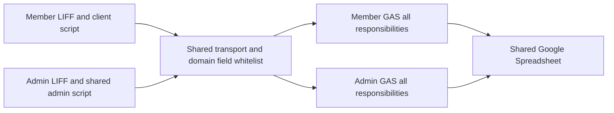

# Security Hardening Proposal: 集中 action contract 並維持雙 GAS 權限邊界

## Decision

我們要決定的是：如何在不破壞現有 LIFF、GAS、Spreadsheet 與冪等流程的前提下，把 action allowlist、payload validation、handler ownership 與頁面狀態從多個大型檔案收斂成可驗證的邊界。這不是因為已證實某條可利用漏洞，而是因為 source 顯示重要控制正由多處手動同步；架構重整應降低未來 drift，而不能削弱目前已正確實作的雙 GAS 隔離。

## Executive Recommendation

完整選項如下：

- Option 1「目標式抽取與強化測試」：只抽出最常變動的 controller/validator，維持現有 transport 白名單與 GAS conditional dispatch。
- Option 2「雙 GAS 模組化單體」：每個部署建立自己的 command registry 與 action contract，transport 只管 envelope；前端以每頁 composition root 組裝功能。這是目前建議。
- Option 3「受管 API 與交易帳本」：以兩個受管 API 權限面和交易型資料庫取代 GAS/Sheets 的核心交易路徑。

我建議 Option 2。它讓我們把安全控制放回擁有危險能力的邊界，同時保持雙部署、URL、LINE audience、Spreadsheet schema 與 request ID 相容。Option 1 的變動最小但難以根治 ownership drift；Option 3 的一致性與觀測能力最好，但在沒有 Sheets 鎖競爭或容量證據前，營運與遷移成本不成比例。

## Evidence

我實際檢查了前端入口、共享 transport、兩套 GAS dispatch/validator、部署文件與測試。最影響判斷的不是檔案長度本身，而是同一 action 的名稱與欄位同時存在於 browser fields、transport 白名單、GAS parser、GAS validator、dispatcher 和測試。

| Evidence | Finding or document | What it establishes |
| --- | --- | --- |
| `E001` | 現有架構與重構路線 | `ARCHITECTURE.md:31-110` 已辨識兩個前端 God Object、transport/domain 耦合與 GAS 單檔問題；`:182-257` 明定漸進拆分方向。 |
| `E002` | Transport domain field whitelist | `shared/gas-api.js:6-30,78-109,152-188` 讓所有 action 的 domain 欄位由 transport 共同擁有。 |
| `E003` | Member front controller | `client/script.js:4-46,66-179,2080-2089,2583-2712` 同時擁有 session、member、points、scanner、UI 與 request 組裝。 |
| `E004` | Admin page multiplexing | `admin/script.js:4-60,121-180,3469-3636` 以 `ADMIN_PAGE` 條件在同一狀態容器和檔案中切換三個工作區。 |
| `E005` | Member GAS manual action ownership | `gas/client/Code.gs:438-490,3799-3848` 以手工 allowlist、conditional dispatch 與 action-specific validation 保護會員部署。 |
| `E006` | Admin GAS manual action ownership | `gas/admin/Code.gs:59-73,504-568,2853-2947` 以 action array、conditional dispatch 和 validator 保護管理部署。 |

這些證據同時顯示一件重要的正面事實：兩套 GAS 都在 LINE verification 和資料讀寫之前拒絕 unsupported action。提案必須保存這條 fast-fail 防線；我們不應把它移到只存在於瀏覽器的 contract。

## Current Design And Failure Mode

目前會員和管理瀏覽器都呼叫 `MemberApi.sendRequest()`。`shared/gas-api.js` 會從 fields 複製一組全系統欄位，再以 fetch 或 iframe bridge 送至對應 GAS。每套 GAS 重新 parse envelope、檢查 action、驗證 LINE token，再用 conditional chain 選擇 domain handler。資料完整性最後依靠 Spreadsheet lock、重讀與唯一性檢查。

觀察到的失效模式是「控制漂移」，不是已驗證的權限繞過。新增或修改 action 時，開發者需要同步更新多層手工清單；漏掉一層通常造成相容性錯誤，錯把欄位加入共用 transport 則擴大所有頁面的 payload surface。大型前端控制器還讓 unrelated state 共用 busy flags、request versions 與 DOM 生命週期。既有 login contract 曾發生 source 與 deployed GAS 不一致，也說明版本漂移是實際運維風險。

安全上，伺服器仍是 authority，所以目前 browser whitelist 遺漏或放寬不等同伺服器漏洞。結構問題在於「什麼欄位屬於什麼 action」沒有單一 owner；未來 review 必須跨多檔案才能證明 allowlist、parser、validator 和 handler 一致。

## Desired Invariants

- 每個部署只接受其 command registry 中明確註冊的 action，且在讀取設定、驗證 LINE、開啟 Spreadsheet 前拒絕未知 action。
- 每個 action 的 input validator、handler、response contract 與冪等策略由同一個部署內 registry 指向，不由 transport 推斷。
- 瀏覽器 transport 只傳送 envelope 與已由 action adapter 建立的 payload；它不知道 phone、claim、lottery prizes 等 domain 欄位。
- 會員 token 永遠不能到達管理 handler；管理 token 也不改用會員 audience。
- 領點、抽獎與管理 mutation 的既有 request ID 必須跨暫時性重試保留。
- page controller 只能存取自己的 DOM 與 use cases；共用 session、transport、clock、storage 以 dependency injection 提供。
- Spreadsheet repository 是讀寫、lock、schema 與唯一性檢查的唯一 owner；domain handler 不直接拼欄位索引。
- 任一 rollout 可在不變更資料格式的情況下切回上一個前端或 GAS 版本。

## Constraints And Non-Goals

- 保留原生 HTML/CSS/JavaScript，未選方案前不新增 bundler 或 runtime dependency。
- 保留 GitHub Pages、兩個 LIFF ID、兩個 GAS `/exec` URL 與現有公開 config shape。
- 保留 Spreadsheet schema、既有資料與雙部署升級順序。
- 本提案不改 UI 視覺、不重算既有點數、不移除 legacy compatibility，也不合併會員與管理 GAS。
- 沒有實測 production 流量、p95 latency、lock contention、Sheet row count 或 cold-start budget；效能結論不是 benchmark。
- 正式 GAS 或外部平台部署不在本輪授權範圍。

## Before Architecture

共同的 before view 見 [目前架構圖](../diagrams/centralize-action-contracts-before.mmd)。關鍵邊是兩個瀏覽器應用先共享一份知道所有 domain 欄位的 transport，再進入各自的大型 GAS。安全隔離存在於部署和 LINE audience，但 contract ownership 橫跨瀏覽器與 GAS。

## Options

### Option 1: 目標式抽取與強化測試

這個選項保留現有部署拓撲、`MemberApi.sendRequest()`、`EXTRA_FIELD_NAMES` 與 GAS conditional dispatch，只把高變動區域抽成 pure validators/controllers，並增加 action matrix 測試。它最吸引人的地方是 rollback 幾乎等同逐檔 revert，也能快速降低 `client/script.js` 的 scanner、history 或 profile 互相干擾。

它的安全改善主要來自更強的 regression coverage，而不是 ownership 改變。server allowlist 仍會保護 authority，但未來新增 action 仍必須同步 transport、parser、validator、dispatcher 與測試。效能沒有額外 hop，記憶體只增加少量模組物件；可靠性會因局部狀態縮小而改善。採用時應一次只抽一個 use case，保持 facade 相容，失敗即回退該模組。

比較 [before](../diagrams/centralize-action-contracts-before.mmd) 與 [Option 1 after](../diagrams/centralize-action-contracts-targeted-extraction-after.mmd)：主要新增的是局部 controller 與跨層 contract tests，shared transport 仍是 domain 欄位 owner。

| Change | Before | After | Security consequence | Cost |
| --- | --- | --- | --- | --- |
| 前端狀態 | 單一大型控制器 | 高變動 use case 局部抽出 | 降低 unrelated state 互相污染 | 需要 facade 相容層 |
| Contract 防線 | 多處手工同步 | 多處同步加 action matrix test | 較早發現 drift，無法消除 drift | 測試維護增加 |
| GAS | 單檔 conditional dispatch | 原結構加局部 helper | 保留現有 fail-closed 行為 | 結構性改善有限 |

### Option 2: 雙 GAS 模組化單體

Option 2 保留所有 deployable boundary，但重畫內部 ownership。會員和管理前端各自有 action contract adapter；adapter 建立 action-specific payload 並驗證 response。共享 transport 僅處理 request ID、callback origin、context、fetch/bridge 與 envelope。管理三頁各有 composition root，只載入 session core 與該頁 controller；會員端也依 session、profile、points、scanner、history 分層。

每套 GAS 建立自己的 command registry。registry entry 指向 input normalization、authorization policy、handler、idempotency policy 與 response projection。未知 action 仍在 config、LINE 與 Sheets 前 fail closed。GAS 按 `00_Config.gs` 到 `99_Utilities.gs` 拆檔只是 source organization；會員和管理仍是兩個專案，不能 runtime import 對方。這讓 security review 可以從 registry 完整列舉 surface，再追到 handler 和 repository，而不用從多條 if chain 推回 contract。

我們會多付出 composition wiring 和 registry 定義的維護成本，但不增加網路 hop，也不要求新 dependency。瀏覽器載入檔案可能增加，總 bytes 主要是重新分配；可用現有 `defer` 和 module registry 維持啟動順序。最大的遷移風險是新舊 controller 同時操作 DOM 或 request ID，因此 rollout 必須以 facade/feature boundary 逐一切換，不能一次替換整個會員頁。

比較 [before](../diagrams/centralize-action-contracts-before.mmd) 與 [Option 2 after](../diagrams/centralize-action-contracts-modular-dual-gas-after.mmd)：最重要的 delta 是 domain contract 從 transport 移到各 application/deployment boundary，Spreadsheet access 由 repository 模組擁有。

| Change | Before | After | Security consequence | Cost |
| --- | --- | --- | --- | --- |
| Payload ownership | transport 共用所有欄位 | 每個 action adapter 擁有 payload | 減少跨 action 欄位 surface 與 review drift | 需建立 contract modules |
| Server dispatch | allowlist 加 conditional chain | fail-fast command registry | 一處列舉 validator、policy、handler | registry 本身成為高信任元件 |
| 前端生命週期 | 大型共享狀態 | 每頁 composition root 與 use case state | 限縮狀態污染與 accidental capability | wiring 和相容 facade 增加 |
| Spreadsheet | handler 可直接依欄位操作 | repository 擁有 schema、lock 與 lookup | 一致性控制集中 | 初期需大量 characterisation tests |
| 部署 | 雙 GAS 單檔 | 雙 GAS 多檔模組化單體 | 保留 audience 與 privilege isolation | 部署腳本/人工貼檔流程需更新 |

### Option 3: 受管 API 與交易帳本

這個選項把會員與管理 command surface 移到兩個受管 API 權限面，使用交易型資料庫記錄 member profile、campaign、redemption 與 draw ledger；LINE token verification 和 idempotency key 由服務層集中執行。它最適合 Sheet row scan、script lock、稽核查詢或併發 mutation 已有量測瓶頸的情況。交易、唯一索引與 observability 會比 Google Sheets 更自然。

安全收益不會自動發生。若把會員和管理路由合併成同一個過度授權服務，反而可能擴大 blast radius；因此 after design 仍需要兩個 service identity、不同 audience policy、最小資料庫權限和分離的 admin surface。新的 secrets、database access、logs、backups、patching 與 incident response 也成為長期責任。

這會增加一個真正的 migration program：雙寫/回填/核對、資料凍結窗口或增量同步、LIFF endpoint 切換、GAS compatibility gateway，以及可證明的 rollback。沒有流量和 contention 證據時，我不建議現在承擔這個成本。比較 [before](../diagrams/centralize-action-contracts-before.mmd) 與 [Option 3 after](../diagrams/centralize-action-contracts-managed-api-ledger-after.mmd) 可看到 datastore 和 operations boundary 都被替換。

| Change | Before | After | Security consequence | Cost |
| --- | --- | --- | --- | --- |
| Runtime | 兩套 GAS | 兩個受管 API 權限面 | 可建立更細 service identity；錯誤合併會擴大 blast radius | 服務、秘密與 patching 維運 |
| Persistence | Spreadsheet 與 script lock | 交易型 ledger 與 unique constraints | 強化原子性與 idempotency enforcement | schema migration、備份與回填 |
| Observability | health 與 client error 為主 | structured audit/metrics/traces | 較快偵測濫用與失敗 | 個資去識別與 log retention 設計 |
| Migration | 原地 source 更新 | 雙寫、核對、cutover、rollback | 可驗證資料完整性，但過渡面更大 | 最高的交付與操作成本 |

## Comparison

以下方向是 source-derived 或 hypothetical，未當作 benchmark：

| Dimension | Option 1 | Option 2 | Option 3 |
| --- | --- | --- | --- |
| Security | 改善測試偵測；ownership 仍分散 | 明顯改善 contract ownership，保留雙邊界 | 潛在最佳 isolation/DB controls，但新增 secrets 與 ops surface |
| Performance | 幾乎中性 | 無網路 hop；可按頁減少無用初始化 | DB 查詢可改善，但多一個平台與冷啟動未知 |
| Memory | 中性 | 小幅增加 registry/composition 物件，頁面可減少無關 state | 服務 runtime、連線池與 telemetry 增加 |
| Reliability | 局部改善 | state、repository、handler 失敗域更清楚 | 交易能力提高；服務與 migration 故障模式增加 |
| Operability | 低變化 | 需要多檔 GAS 發布檢查與 contract inventory | 最高：監控、備份、on-call、秘密輪替 |
| Migration | 最低 | 中等，可逐 facade/頁面/action 切換 | 最高，需要資料遷移與 cutover |
| Developer ergonomics | 熟悉但仍需跨層搜尋 | registry 與 page root 提供明確入口 | 工具更完整但平台知識和 infra 成本高 |
| Rollback | 逐檔 revert | 逐 composition root / GAS version 回退 | 需保留 GAS compatibility 與資料反向同步能力 |

驗證方式應對應機制：Option 1/2 比較 demo boot time、script bytes、request 次數與全測試；Option 2 額外證明 registry action 集合和 browser contract 集合一致；Option 3 則需以 production-like row counts、concurrency、p95 latency、error rate 和 migration reconciliation 作決策，不能用直覺宣稱更快。

## Recommendation

在 balanced 約束下，我建議 Option 2。它直接處理 E002–E006 顯示的 ownership 問題，卻不改變 E001/E007 明定的雙 GAS trust boundary 和部署相容性。讓我對它保持謹慎的是 rollout ordering：前端 contract、GAS parser/validator 與部署版本如果不同步，會重演 source-green/deployment-stale 的連線錯誤。因此 implementation plan 必須把 capability/version health、舊 action compatibility 和雙部署順序列為 acceptance criteria。

如果近期只允許非常小的 change budget，Option 1 應勝出；如果已量測到 Sheets lock/contention 或交易稽核需求超過 GAS 能力，Option 3 才應重新評估。缺少這兩類新證據時，Option 2 的安全收益、相容性與回滾性最平衡。

## Evidence Coverage And Residual Risk

| Evidence | Option 1 | Option 2 | Option 3 | Tactical protection still required |
| --- | --- | --- | --- | --- |
| `E001` — 現有架構與路線 | mitigates | addresses | addresses | 保留雙 GAS 邊界與漸進 rollout |
| `E002` — Transport domain whitelist | unaffected | addresses | addresses | server-side validation 永遠保留 |
| `E003` — Member front controller | mitigates | addresses | addresses | request ID、token recovery、scanner cleanup regression tests |
| `E004` — Admin page multiplexing | mitigates | addresses | addresses | admin authorization tests 與 page-specific data loading |
| `E005` — Member GAS manual ownership | mitigates | addresses | addresses | unknown action 在 config/LINE/Sheets 前 fail closed |
| `E006` — Admin GAS manual ownership | mitigates | addresses | addresses | `Admins.status` 與 admin audience verification |

Option 2 完成後仍有 residual risk：Google Sheets 不會變成交易型資料庫；跨列 mutation 仍需要 lock、重讀、唯一性檢查和永久 request ID ledger。Browser contract 也不是 authority，不能取代 GAS validation。最後，多檔 source 若仍靠人工複製到 Apps Script，可能產生 partial deployment；需要發布清單或 `clasp` 類 workflow，但導入工具前要另行審核權限和 secrets。

## Migration And Rollout

Option 2 應採相容性優先的批次，而不是全面重寫：

- 先凍結可搜尋的 action inventory、response envelope 與公開 facade，建立 characterisation tests。
- 新增 browser action contract adapters，但讓它們仍呼叫現有 `MemberApi.sendRequest()`。
- 把 transport 改成 envelope plus payload，短期保留 legacy field adapter；確認所有 action 後再移除全域欄位白名單。
- 先拆 admin 三頁 composition roots，因為頁面界線已存在；每頁切換可獨立回退到 `admin/script.js`。
- 再拆 member session/profile/points/scanner/history；抽獎既有 v2 facade 保持不變。
- 在 GAS 內先引入 command registry 和 test adapter，行為不變後才按 config/identity/auth/domain/repository/migration 拆 `.gs` 檔。
- 先部署管理 GAS、再會員 GAS、確認 health/version/capabilities，最後發布前端；任何一階段失敗都回退該 GAS deployment version 或前端 script tags。

資料 migration 為 none；Option 2 不應改 schema。若實作過程發現需要改欄位或 action signature，必須回到設計審查並補相容方案。

## Validation Plan

- 既有完整測試 `node --test tests/*.test.js`；先處理或明確隔離目前 CSS 結構測試失敗，不能把它誤歸因於架構變更。
- 新增 contract inventory test：browser action adapters、member registry、admin registry 與 public documentation action 集合一致。
- 每個 action 測 success、unknown fields、missing fields、wrong role/audience、invalid token、request replay、bridge/fetch parity。
- 驗證 unsupported member/admin cross-action 在 `getConfig_`、LINE fetch 和 Spreadsheet access 前失敗。
- 以 demo pages 量測各頁 transferred script bytes、parse/evaluate time、boot duration 與不必要 action/data fetch 數量；與現況相同裝置和 cache 狀態比較。
- 以 production-like Sheet rows 測 list/history、redemption/draw lock duration 和 duplicate request behavior；未定 threshold 前只記錄 baseline，不宣稱改善。
- 執行 `node --check`、JSON parse、`git diff --check`、完整 diff review 和 secrets scan。
- source-green 後仍要由人員另外授權並驗證兩個 live `/exec?action=health` 版本；repo test 不能代表部署已更新。

## Implementation Work Packages

- WP1：建立 action inventory、contract test harness 與相容 facade。
- WP2：將 `shared/gas-api.js` 收斂成 envelope-only transport，提供 legacy adapter 過渡。
- WP3：拆 admin session core 與 members/points/lottery page composition roots。
- WP4：拆 member session、profile、points、scanner、history controllers，保留 lottery facade。
- WP5：會員 GAS command registry 和多檔模組化，保持 action/response 不變。
- WP6：管理 GAS command registry 和多檔模組化，保持 admin authorization 不變。
- WP7：效能/lock baseline、部署版本檢查、README/ARCHITECTURE 更新與 rollback rehearsal。

每個 work package 必須有獨立 acceptance test 和 rollback boundary。選定 Option 2 後，才會把這些項目轉成 `implementation/modular-dual-gas.md` 的具體檔案、順序與命令。

## Open Questions

- 是否確認選擇 Option 2，或 change budget 只允許 Option 1？
- 是否願意在後續導入 `clasp` 或其他可重現的 Apps Script 多檔發布流程？這會涉及 Google account 權限與 secrets 管理，不能默認啟用。
- production 的 Sheet row count、尖峰 concurrent mutations、p95 login latency 和 script lock timeout 是否可量測？這些數據決定 Option 3 何時有合理性。
- 現有 `.lottery-center-button` CSS 測試失敗要在架構實作前獨立修復，還是以已知 baseline 暫時隔離？
