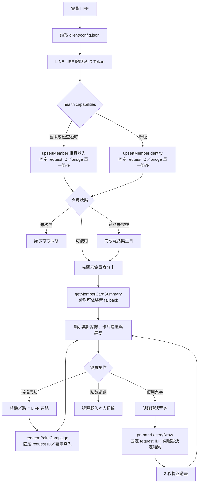
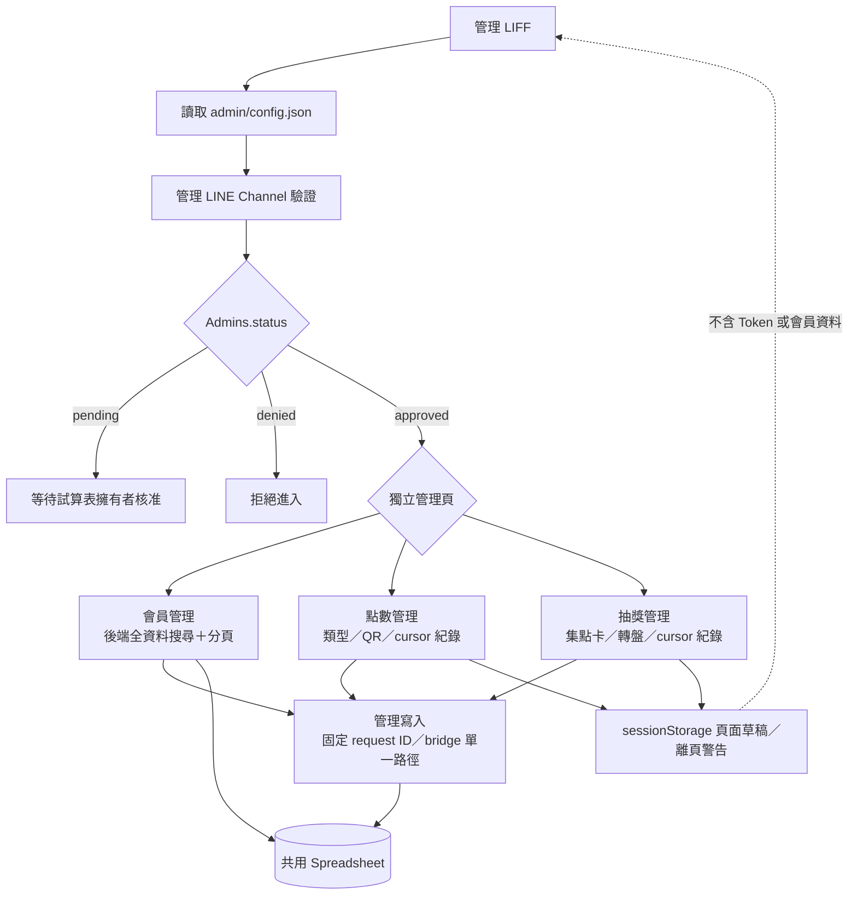

# 系統架構與維護邊界

本文件描述目前會員系統的實際執行架構、資料所有權、安全邊界與後續重構方向。部署步驟與 Script Properties 請以 [`README.md`](README.md) 為準。

## 1. 執行拓撲

```text
會員 LIFF / 管理 LIFF
        │
        ├─ 讀取各自的 config.json（只含公開設定）
        ├─ 使用 LINE LIFF SDK 取得 ID Token
        └─ 經 shared/gas-api.js 發送有限欄位的請求
                    │
          ┌─────────┴─────────┐
          │                   │
    會員 GAS Web App     管理 GAS Web App
    gas/client/Code.gs   gas/admin/Code.gs
          │                   │
          └─────────┬─────────┘
                    │
             共用 Google Spreadsheet
```

會員端與管理端是兩個不同的 LINE Channel、LIFF App 與 GAS 部署。兩端唯一共用的持久資料是 Google Spreadsheet；任何一端都不能改用另一端的 ID Token audience 或 GAS URL。

### 會員端流程圖



### 管理端流程圖



### 請求生命週期

| 階段 | 通訊與時限 | 一致性／授權 |
| --- | --- | --- |
| 公開設定 | 同源 `GET config.json`，並平行讀取 GAS 公開 health capabilities | 只允許 LIFF ID、GAS `/exec` URL、品牌、服務版本與能力名稱等公開值；舊後端自動使用相容登入 action |
| 讀取 API | 先使用該裝置對 GAS URL 最近成功的通道；Fetch 9 秒、bridge 25 秒，網路層失敗才切換一次 | request ID 綁定回應，GAS 重新驗證 LINE ID Token |
| 寫入 API | 固定使用隱藏 form／iframe bridge；會員登入同步最多 45 秒，其他寫入 25 秒；不在同一次操作改送另一個通道 | 驗證 GAS origin、callback origin、request ID 與一次性 secret；逾時視為結果未知，以相同 request ID 重試 |
| 身分驗證 | LINE verify 成功結果最多暫存 5 分鐘 | 只快取 `sub`、`iat`、`exp`；權限與會員資料仍即時讀 Sheet |
| 資料處理 | 會員先讀身分、再讀卡片摘要；管理搜尋在後端分頁前執行，歷史紀錄只讀 cursor 視窗 | 寫入持鎖且使用 request ID 冪等；讀取不長時間占用寫入鎖 |

成功的讀取通道名稱會依 GAS URL 寫入 sessionStorage 與 localStorage，讓同一裝置後續讀取直接使用已驗證可行的通道。這個提示不包含 Token、會員 ID 或任何業務資料；儲存空間不可用時會安全退回 Fetch。所有會員與管理寫入都維持單一 bridge 請求，避免 Fetch 已寫入但前端逾時後又用另一個通道重送。

## 2. 前端入口與責任

| 入口 | 程式 | 責任 |
| --- | --- | --- |
| `client/index.html` | `client/script.js`、`client/member-lottery.js` | 會員登入、會員卡、QR 領點、滿版抽獎券、轉盤與滿版點數紀錄 |
| `client/lottery.html` | `client/lottery.js` | 舊抽獎連結的相容 fallback |
| `admin/index.html` | `admin/script.js` | 會員查詢與使用權限 |
| `admin/points.html` | `admin/script.js` | 點數類型、活動 QR 與領點紀錄 |
| `admin/lottery.html` | `admin/script.js` | 集點卡規則、轉盤設定與中獎紀錄 |

共用瀏覽器模組：

- `shared/gas-api.js`：公開設定讀取、請求欄位白名單、讀取通道 fallback、寫入單一路徑、固定 request ID 與階段狀態回報。
- `shared/liff-runtime.js`：LIFF 環境資訊、展示模式與公開設定完整性檢查。
- `shared/lottery-wheel.js`：管理端預覽與會員端轉盤共用的 Canvas 繪製。
- `shared/qr-code.js`：管理端本機 QR Code 編碼，不把領點網址交給第三方服務。

所有共用模組都必須在頁面自己的程式之前載入。前端只負責顯示與送出意圖，不可自行決定中獎結果、會員權限或可領取點數。

## 3. 後端責任

### 會員 GAS

- 只接受會員 action。
- 使用會員 Channel ID 向 LINE 驗證 ID Token。
- 建立或同步會員、修改本人電話與生日、刪除本人資料。
- 驗證並兌換點數活動。
- 依期限計算集點卡當輪狀態與可用抽獎券，同時保留終身累計。
- 在伺服器依已儲存機率決定獎項並保存結果。

### 管理 GAS

- 只接受管理 action。
- 使用管理 Channel ID 向 LINE 驗證 ID Token。
- 只依 `Admins` 工作表的 `approved` 狀態授權。
- 管理會員使用權限、點數類型與活動、集點卡規則及轉盤版本。
- 查詢經過欄位裁切的會員、領點與中獎紀錄。

兩套 `Code.gs` 必須能獨立貼入及部署。兩檔內目前仍有相同的 Sheet schema 與解析程式，這是獨立 GAS 專案造成的部署限制，不應直接改成瀏覽器式 import。共用資料契約的同步由測試保護；若未來導入建置流程，才適合由單一 schema manifest 產生兩端常數。

## 4. Spreadsheet 資料所有權

| 工作表 | 主要寫入者 | 用途 |
| --- | --- | --- |
| `Members` | 會員 GAS、管理 GAS | 會員資料與使用權限 |
| `Admins` | 管理 GAS、試算表擁有者 | 管理員申請與人工核准 |
| `PointTypes` | 管理 GAS | 可發放的點數規則 |
| `PointCampaigns` | 管理 GAS | 已發行 QR 活動與規則快照 |
| `PointRedemptions` | 會員 GAS | 點數領取帳本與終身累計依據 |
| `PointCardSettings` | 管理 GAS | 卡片滿點、期限、抽獎節點與指定轉盤 |
| `LotteryTypes` | 管理 GAS | 轉盤類型生命週期與抽獎券逐獎項預覽設定 |
| `LotteryPrizes` | 管理 GAS | 不可變的轉盤設定版本與機率 |
| `LotteryDraws` | 會員 GAS | 實際抽獎結果 |

點數餘額與集點卡進度應由帳本重新計算，不由瀏覽器或 `Members` 顯示值當作權威資料。軟刪除的點數類型與轉盤仍保留歷史資料。

## 5. 安全與一致性邊界

- `config.json`、LIFF ID、GAS `/exec` URL 都是公開資料；秘密只放在 GAS Script Properties。
- GAS 必須重新驗證 ID Token 的 audience、issuer、subject 與時效，不信任前端傳入的 LINE user ID。
- 會員與管理 GAS 只可把已驗證 Token 的 `sub`、`iat`、`exp` 以 SHA-256 Token key 暫存最多 5 分鐘；原始 Token、姓名與頭像不可進入 CacheService 或效能紀錄。會員權限、管理權限、點數與抽獎資料仍必須每次讀取 Spreadsheet。
- `ALLOWED_ORIGINS` 只接受完整 origin；所有回應都綁定 request ID，iframe bridge 另外驗證回應 origin 與一次性 secret。
- 會員與管理 action 使用白名單分流，未知欄位不進入業務函式。
- 點數領取、抽獎與管理寫入使用 request ID 保持重試冪等。
- 中獎機率與結果只在會員 GAS 計算；Canvas 動畫只呈現伺服器已回傳的獎項。
- 管理員核准只允許試算表擁有者手動修改 `Admins.status`，前端沒有提升管理權限的 API。
- Google Sheets 不是關聯式資料庫。點數與抽獎寫入必須持續使用 lock、重讀與唯一性檢查；純讀取 action 不占用全域 lock，改用 request-scoped 快照與版本檢查。

## 6. 本次重構決策

- 會員首頁是日常操作中心：掃碼、票券狀態與點數紀錄不再要求頁面跳轉。
- 登入先檢查公開 health capabilities；支援新合約時以 `upsertMemberIdentity` 建立或核對會員並立即顯示身分卡，再以 `getMemberCardSummary` 漸進載入點數、集點卡與票券。舊部署缺少能力名稱時自動改用 `upsertMember`，避免前後端發布不同步造成逾時；首次會員完成電話與生日後才發送加入通知並開放後續操作。
- 抽獎券摘要只附上最新轉盤中被選取的獎項名稱，不傳機率。票券清單與轉盤資源延遲到使用時載入；選定可用券後先明確確認，再以單一 `prepareLotteryDraw` 和固定 request ID 保存結果並回傳轉盤，中央按鈕只播放固定 3 秒動畫。
- 待確認抽獎以 LIFF 與已驗證會員編號隔離，展示模式另用獨立空間；結果未知時保留同一 request ID，後台明確確認未開獎時才解除鎖定並重載票券。
- 集點卡期限採 append-only 設定；到期後捨棄當輪進度與未用券，但不改寫點數帳本或已抽紀錄。
- 把三份重複的 Canvas 轉盤程式整合為 `shared/lottery-wheel.js`。
- 把三份重複的 LIFF context、展示模式與 config 完整性檢查整合為 `shared/liff-runtime.js`。
- 保留頁面、舊 `drawLottery` action 與 GAS 部署方式，新增 `prepareLotteryDraw` 與需會員驗證但不記錄身分的 `reportClientPerformance`；`LotteryTypes` 只在尾端追加相容欄位，舊 9 欄資料由 `setup()` 補成關閉預覽，既有 10 欄的整組預覽設定則相容轉成全部獎項皆顯示。
- 效能紀錄只接受固定 phase、耗時、結果、transport、fallback 與錯誤碼；快速成功不回報，背景回報失敗立即重試一次，Cloud Logging 不包含 LINE ID、Token、姓名、電話、生日或 request ID。
- 會員登入、集點卡、點數紀錄與抽獎只讀取該會員的帳本列；領點與登入完成必要寫入後會在組合卡片回應前釋放鎖。點數紀錄以同一份列快照同時計算餘額與清單。
- 管理端相同 Token 的連續頁面請求不重複呼叫 LINE verify，也不在姓名、頭像與登入 session 未變時重寫 `Admins`。五個管理讀取 action 完成核准檢查後立即釋放鎖，再讀取各自資料頁需要的工作表。
- 管理會員搜尋與狀態篩選在 GAS 對完整資料集執行後才分頁；點數及抽獎紀錄使用 cursor 讀取固定尾端視窗，並提供逐頁載入與防公式注入的 CSV 匯出。
- 點數與抽獎編輯草稿只保留在同一分頁的 `sessionStorage`，大小上限 50 KB，不儲存 Token、管理員身分或會員資料；成功寫入後清除對應草稿，尚有草稿時離頁會警告。

## 7. 後續重構順序

目前最大的維護成本是 `admin/script.js` 同時承載三個管理頁，以及兩套大型 `Code.gs` 的契約同步。建議依下列順序小步處理：

1. 將管理端依 `members`、`points`、`lottery` 拆成頁面控制器，保留共用登入 session 與錯誤處理。
2. 將會員端點數領取、個人資料與集點卡紀錄拆成獨立功能模組。
3. 建立不含執行平台程式的 schema manifest，讓測試檢查兩套 GAS 的欄位、狀態與 action 契約。
4. 若資料量或並行寫入明顯增加，再評估把帳本移到具交易能力的資料庫；不應只靠前端最佳化掩蓋 Sheet 限制。

每一階段都應保持兩套 GAS 可獨立部署，並在更動資料契約前先補跨端 contract test。

## 8. 驗證

本專案沒有套件依賴與建置步驟。

```bash
# 全部自動測試
node --test tests/*.test.js

# 瀏覽器 JavaScript 語法
node --check shared/gas-api.js
node --check shared/liff-runtime.js
node --check shared/lottery-wheel.js
node --check client/script.js
node --check client/lottery.js
node --check admin/script.js

# GAS 語法（Node 不辨識 .gs 副檔名，因此由 stdin 檢查）
node --check < gas/client/Code.gs
node --check < gas/admin/Code.gs
```
